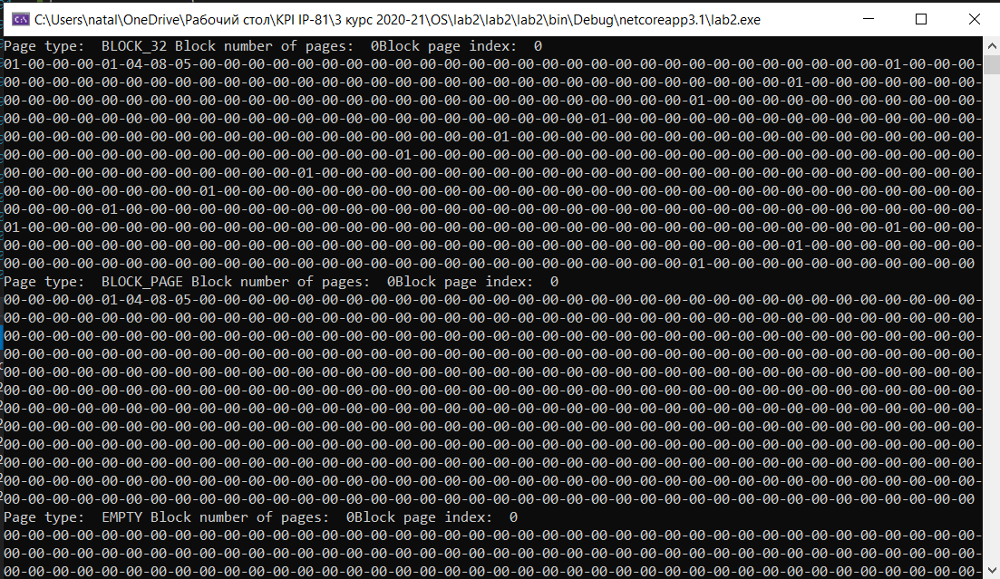

# Lab 2 - Allocator with paging
## DESCRIPTION
## About allocator

A general purpose memory allocator must do at least **three tasks**: 
***allocating** a block of memory* of a given size, ***freeing** the allocated memory block* and 
***resizing** the allocated memory block*. These functions constitute a general purpose memory allocator interface.

Each block has a **header** and the **data**. Header always has a fixed size of **12 bytes**.
All blocks are **4-byte** aligned.
That means, to allocate **8 bytes** of memory, we need at least **24 bytes** of free memory. The structure of header:
> [memory size(4 bytes), previous block memory size(4 bytes), boolean is block free(1 byte), placeholder(3 bytes)]

### Algorithm description

#### Allocate function
```
void* mem_alloc(size_t size)
```

When the `mem_alloc` function has called, it searches for the page with a suitable block size type or an empty page.
If it found such page - it searches for the free block and occupies it. If free block wasn't found - page search process
continues. If empty page was found - it's assigned to a suitable block size type.

### Reallocate function
```
void* mem_realloc(void* addr, size_t size)
```

This function calls first of all decides, if it has to make the block smaller or bigger.
Block is marked as *'free'*, and new block is allocated (called alloc(size)).

### Free memory function
```
void mem_free(void* addr)
```

The function flags block as *'free'* block.

## DEMONSTRATION

>All memory state outputs are made with the `mem_dump` function, which, basically, 
>goes through 'our' heap and prints the states of all the existing blocks.

### The allocation of *24* bytes of memory
#### Memory will be successfully allocated
##### Code
```
PageMemoryAllocator allocator = new PageMemoryAllocator(1024);
            int ind1 = allocator.MemAllocate(24);
            allocator.WriteArray(ind1, new byte[] { 1, 4, 8, 5 });
            allocator.MemRealloc(ind1, 48);
            Console.WriteLine(allocator.MemDump());
            Console.ReadKey();
```

##### Output

---

